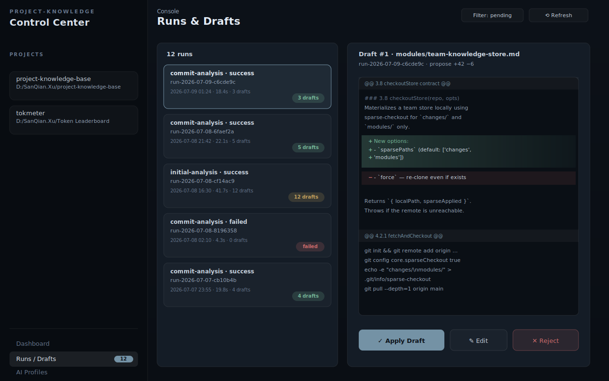
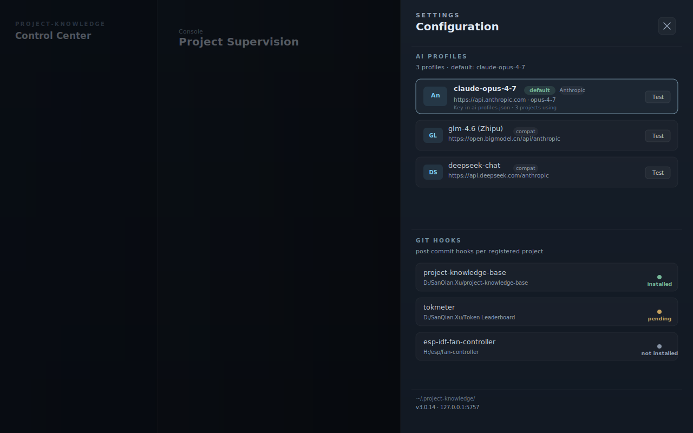
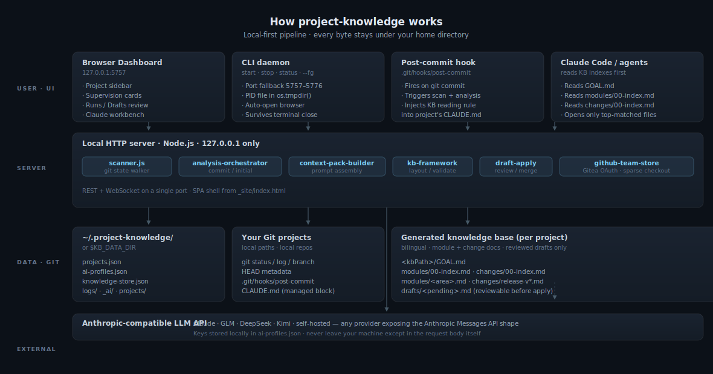

<p align="center">
  
</p>

<p align="center">
  <strong>Local knowledge-base manager for Git projects.</strong><br>
  Scan history. Generate reviewable AI drafts. Ship a curated bilingual KB.
</p>

<p align="center">
  <a href="https://www.npmjs.com/package/project-knowledge"></a>
  
  
  <a href="https://github.com/SanQianX/project-knowledge-base/actions"></a>
  <a href="#star-history"></a>
</p>

<p align="center">
  <a href="README.md">English</a> · <a href="docs/README.zh-CN.md">简体中文</a>
</p>

---

## Install

```bash
npm install -g project-knowledge
project-knowledge
```

The dashboard opens at **http://127.0.0.1:5757**. If 5757 is busy, the CLI
walks `5757–5776` and prints the actual URL. The daemon survives terminal
close — `project-knowledge stop` shuts it down.

```bash
project-knowledge            # start (default), auto-open browser
project-knowledge --fg       # foreground, Ctrl+C to stop
project-knowledge stop       # stop the background daemon
project-knowledge status     # print running PID + port
project-knowledge --port 9000   # bind to a specific port
project-knowledge --no-open     # don't auto-open browser
```

Requires **Node.js 18+** and **Git on `PATH`**. Optional: any
Anthropic-compatible API profile for AI drafts.

<p align="center">
  
</p>

---

## What it does

```
   git commit ──► post-commit hook ──► scanner ──► orchestrator ──► AI
                                                          │            │
                                                          ▼            ▼
                          ~/.project-knowledge/      drafts/      Anthropic-compat
                                                          │
                                                          ▼
                                              browser diff review
                                                          │
                                                          ▼
                                           your KB grows only by your click
```

`project-knowledge` watches your local Git projects, asks an
Anthropic-compatible LLM to draft knowledge entries from each commit or
branch, and surfaces those drafts in a side-by-side diff. You **apply**,
**edit**, or **reject** each one. The trusted KB (`modules/`, `changes/`)
only grows when you say so.

---

## Features

<table>
  <tr>
    <td width="50%" valign="top">

**Local-first**

- Browser dashboard on `127.0.0.1` — no public exposure.
- All state under `~/.project-knowledge/` (or `$KB_DATA_DIR`).
- Runtime data survives every `npm install -g` upgrade.
- API keys stored locally in `ai-profiles.json`, never synced.
- Server binds to loopback only.

</td>
    <td width="50%" valign="top">

**Git-aware**

- Per-project pending-commit scan from `git log`.
- Post-commit hook auto-fires on every commit.
- Inject a KB-reading rule into each project's `CLAUDE.md` so Claude Code
  reads indexes before opening modules.
- Branches, remotes, HEAD metadata, reflog.

</td>
  </tr>
  <tr>
    <td valign="top">

**Reviewable AI drafts**

- Every AI change lands in `drafts/` first, never the KB.
- Browser diff view with apply / edit / reject.
- Bilingual (zh-CN / en-US) module + change docs by default.
- Provider-agnostic: Claude, GLM, DeepSeek, Kimi, self-hosted.

</td>
    <td valign="top">

**Team Knowledge Mode (v3.0.13+)**

- Shared KB repo via GitHub or Gitea OAuth (client-secret, v3.0.12+).
- Sparse-checkout pulls only `changes/` and `modules/`.
- Discovery lists repos with a `team-store.json` manifest.
- Personal-mode projects continue to work alongside team bindings.

</td>
  </tr>
</table>

---

## Dashboard

<p align="center">
  
</p>

The supervision view at a glance: pending-commit counts across every
project, the selected project's status pill (repo / pending / goal / KB),
the pending commits table, action buttons (`Analyze commits`, `Scan
repository`, `Rebuild KB`), and a Claude workbench panel on the right
for project-scoped conversation.

---

## Review before it ships

<p align="center">
  
</p>

Each analysis run produces a list of drafts. Each draft opens in a
side-by-side diff against the current KB — you see exactly what the AI
wants to add or change before anything touches `modules/` or `changes/`.

---

## Configuration

<p align="center">
  
</p>

The settings drawer manages AI profiles, post-commit hook installation
per project, log retention, language/theme, and GitHub / Gitea team-store
configuration. Every action is local; nothing leaves your machine except
the AI request body itself.

---

## Architecture

<p align="center">
  
</p>

The flow above shows the four layers: user-facing UI (browser + CLI +
hook + Claude Code), the local Node.js server with its specialized
modules, the data layer (`~/.project-knowledge/` + your Git repos +
generated KB), and the external LLM endpoint.

The dashed line on the right represents the **KB reading rule**: when
Claude Code (or any Anthropic-compatible agent) opens a project that has
this app's `CLAUDE.md` block, it reads `GOAL.md` and the module / change
indexes before opening detail files. That keeps context window usage
linear with task size, not with KB size.

---

## CLI reference

| Command | Effect |
|---|---|
| `project-knowledge` | Start in background, auto-open browser |
| `project-knowledge --fg` | Foreground (Ctrl+C to stop) |
| `project-knowledge stop` | Stop the background daemon |
| `project-knowledge status` | Print running PID + port, or `not running` |
| `project-knowledge --port <p>` | Bind to `<p>`; auto-fallback to `<p>+1…+19` |
| `project-knowledge --host <h>` | Bind to host `<h>` (default `127.0.0.1`) |
| `project-knowledge --no-open` | Don't open the browser |
| `project-knowledge -v` / `--version` | Print version and exit |
| `project-knowledge -h` / `--help` | Print full help |

The CLI writes a PID file at `os.tmpdir()/.project-knowledge.pid`.
Closing the original terminal does **not** stop the dashboard — use
`project-knowledge stop`.

---

## CLAUDE.md reading rule

When you install the post-commit hook in an imported project,
`project-knowledge` writes a managed block into that project's
`CLAUDE.md`:

```markdown
<!-- KB-MANAGED:CLAUDE-MD:START — managed by project-knowledge -->
## Knowledge Base Reading Rule

This project's knowledge base lives at:
  <absolute path registered in projects.json>

Before implementing a non-trivial feature or fix in this repo:

1. Read only the indexes: <kbPath>/GOAL.md, <kbPath>/modules/00-index.md,
   <kbPath>/changes/00-index.md.
2. Compare the request, changed files, API routes, symbols, and keywords
   against the module and change indexes.
3. Open only the top-relevant module and change docs based on the match.
4. No hits? Treat as a new feature area — propose a new module + change
   entry instead of patching unrelated knowledge.
5. Do not load the whole KB unless explicitly asked.
6. After implementation, summarize whether the KB needs an update.
<!-- KB-MANAGED:CLAUDE-MD:END -->
```

Re-installing the hook refreshes the absolute `kbPath` and replaces the
block in place (HTML-comment markers keep it idempotent). Uninstall
removes only the managed block — your own content is preserved. Pass
`updateClaudeMd: false` to either hook call to skip this behavior.

This means **Claude Code (or any Anthropic-compatible agent) reads the
KB indexes before opening modules**, drastically cutting token usage on
context-heavy tasks.

---

## Runtime data

Everything lives in a single directory **outside** the npm package, so
`npm install -g project-knowledge` upgrades never touch your registry,
profiles, KBs, drafts, or logs.

**Default:** `~/.project-knowledge/` &nbsp;·&nbsp; **Override:** `KB_DATA_DIR`

```bash
KB_DATA_DIR=D:/data/project-knowledge project-knowledge
```

On first run after upgrading from 1.x, legacy runtime files inside the old
npm package directory are silently copied into the new data directory.
Migration only runs when `<dataDir>/projects.json` does not yet exist,
never overwrites anything in the new location, and never prompts.

```
~/.project-knowledge/
├── projects.json              # local project registry
├── projects/<slug>/           # generated KB (per project)
│   ├── GOAL.md
│   ├── modules/<area>.md      # curated module docs
│   └── changes/release-v*.md  # curated change records
├── _ai/<slug>/drafts/         # reviewable AI drafts (never auto-applied)
├── ai-profiles.json           # AI profile config + API keys
├── knowledge-store.json       # external / team KB settings
├── logging.json               # log retention
├── logs/                      # structured runtime logs
└── claude-prompts.json        # bundled prompt registry
```

---

## Repository layout

```
_site/
├── index.html                # dashboard UI (Vue + Tailwind, single file)
├── server.js                 # local HTTP API (REST + WebSocket)
└── lib/
    ├── scanner.js              # git state walker
    ├── analysis-orchestrator.js  # initial / commit analysis
    ├── context-pack-builder.js   # AI prompt assembly
    ├── kb-framework.js          # KB layout, write, validate
    ├── draft-apply.js           # apply / reject drafts
    ├── knowledge-store.js       # external KB config
    ├── github-team-store.js     # team mode · Gitea OAuth · sparse checkout
    ├── hook-manager.js          # post-commit hook install / uninstall
    ├── claude-md-manager.js     # CLAUDE.md managed block writer
    ├── ai-adapter.js            # Anthropic-compatible LLM client
    └── supervision.js           # issues / warnings aggregator

bin/project-knowledge.js       # CLI entrypoint
templates/                    # KB markdown templates
docs/                         # public schemas, plans, screenshots
```

The public boundary is documented in [`INDEX.md`](INDEX.md) and
[`CHANGELOG.md`](CHANGELOG.md).

---

## Team Knowledge Mode

v3.0.13+ adds team-store support: turn a GitHub repository (or a
self-hosted Gitea instance) into a shared knowledge layer without running
a cloud service of our own.

- One Git repo holds many projects' KBs as sub-directories.
- A `team-store.json` manifest declares which KBs exist.
- Per-user local clone uses **sparse-checkout** so only `changes/` and
  `modules/` materialize — the full history never touches your disk.
- v3.0.12 adds **client-secret OAuth** for Gitea (and any GitHub-compatible
  OAuth provider), so you don't have to mint personal access tokens.

Design: [`docs/team-knowledge-mode-a-plan.md`](docs/team-knowledge-mode-a-plan.md) ·
Schema: [`docs/project-registry-schema.md`](docs/project-registry-schema.md)

---

## Testing

```bash
npm test
```

The regression suite under `_site/_test/` covers:

- AI profile validation, scanner behavior, context pack generation
- Initial and commit analysis
- Draft apply / reject, knowledge-store, structured logs
- Project control panel flows, Runs / Drafts UI flow
- CLI startup / stop / status
- Gitea OAuth + sparse checkout
- 36 tests, 0 failures, ~110s on a cold cache

---

## Publishing

Tag-driven: pushing a `v*` tag triggers
`.github/workflows/publish.yml` → `npm publish --provenance --access public`.

```bash
npm test
npm pack --dry-run
git status --short
git commit -m "Release vX.Y.Z"
git tag -a vX.Y.Z -m "vX.Y.Z"
git push origin main
git push origin vX.Y.Z
npm view project-knowledge version dist-tags
```

The workflow expects the `NPM_TOKEN` repository secret. Verify that
runtime data, KBs, drafts, logs, and credentials are not part of the Git
tree or npm package before tagging.

---

## Requirements

- **Node.js 18+** — uses native `fetch` and ES2022 features
- **Git** on `PATH` — every scanner call goes through it
- **Windows, macOS, or Linux** — only the Windows scheduled-task workflow
  is platform-specific
- **Optional** — Claude Code CLI or any Anthropic-compatible API profile
  for drafts. Without one, the dashboard still scans and visualizes git
  state.

The server binds to `127.0.0.1` by default. Do not expose it publicly.

---

## Contributing

Issues and pull requests welcome on
[github.com/SanQianX/project-knowledge-base](https://github.com/SanQianX/project-knowledge-base).
Run `npm test` before opening a PR; for larger changes, open an issue
first so we can align on direction.

## License

[Apache-2.0](LICENSE) — see also [NOTICE](NOTICE).

## Star history

<p align="center">
  <a href="https://star-history.com/#SanQianX/project-knowledge-base">
    
  </a>
</p>